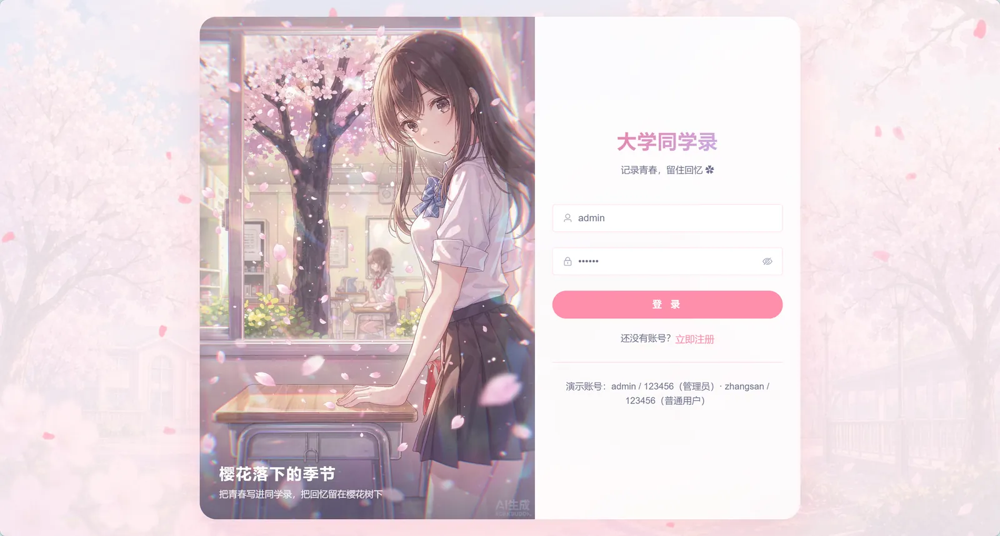
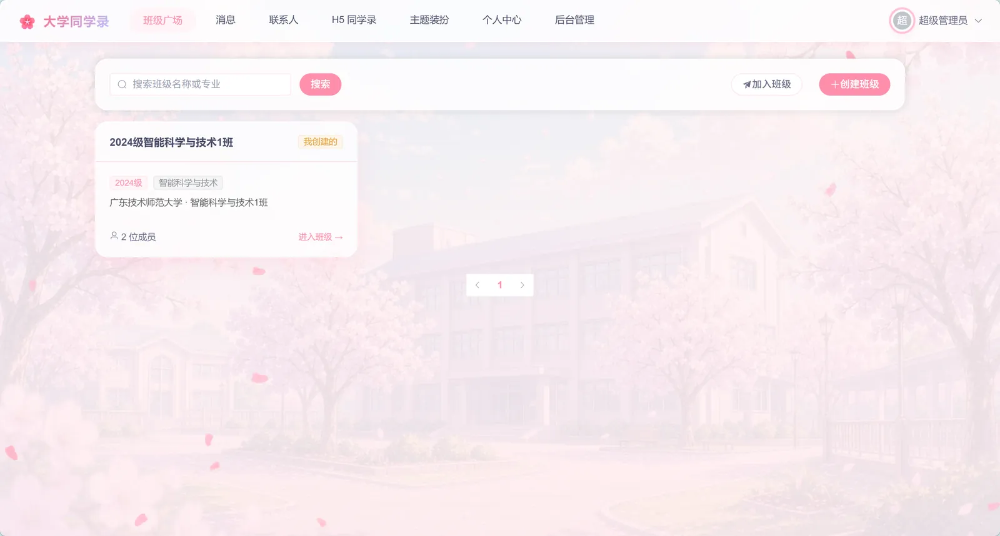
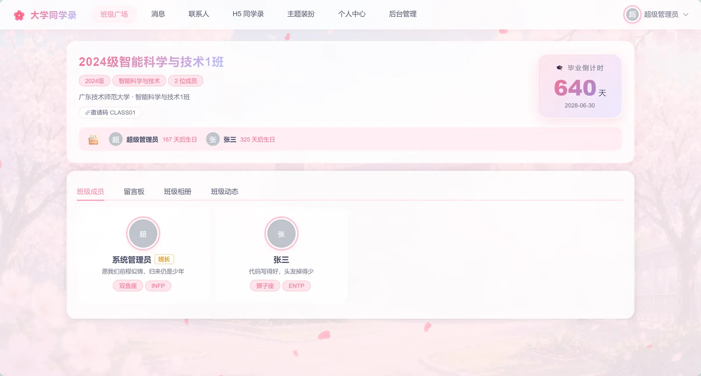
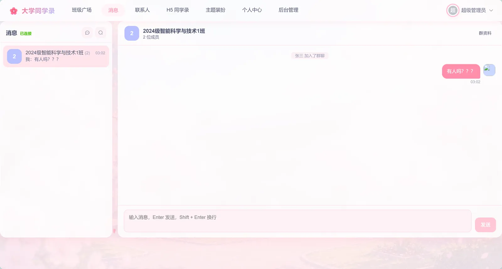
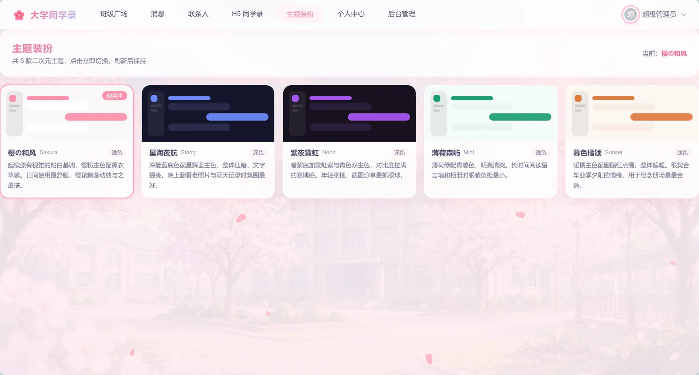
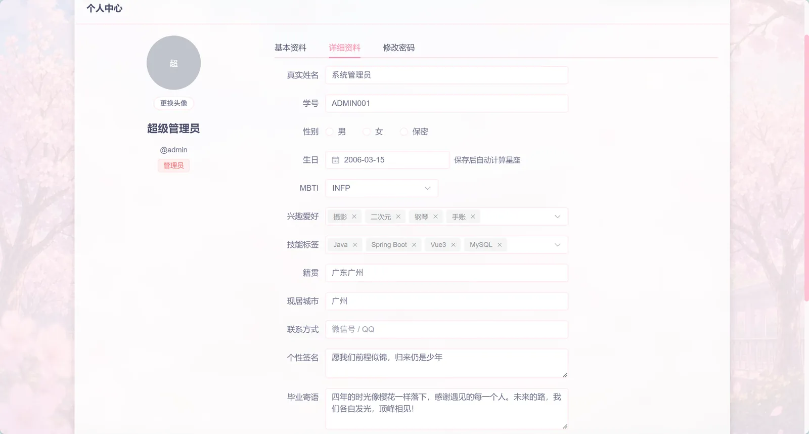
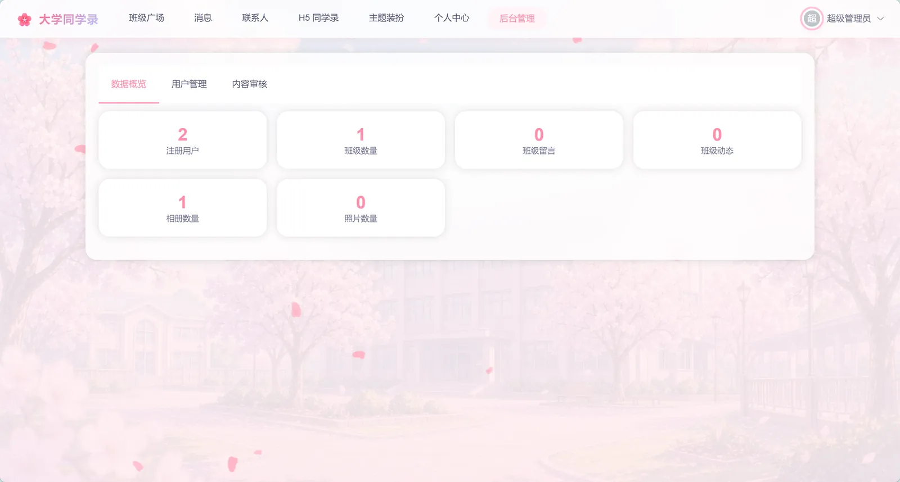
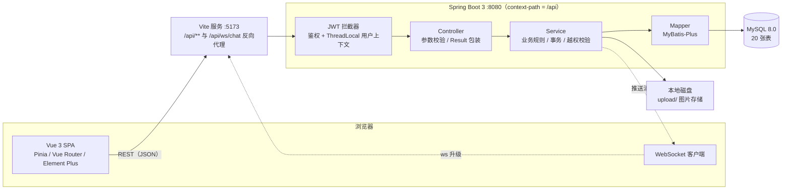
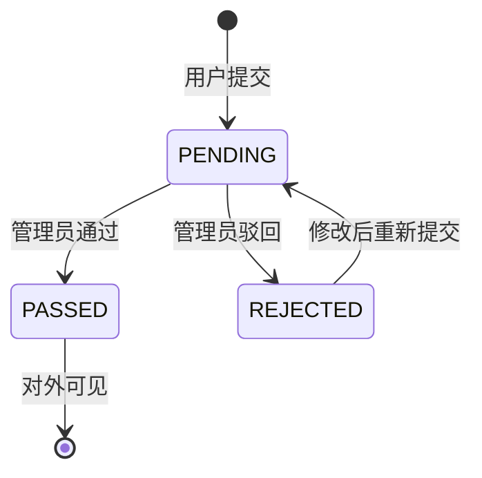

<div align="center">

# 大学同学录 · schoolmate_book

**把「班级」装进浏览器** —— 班级主页 · 留言墙 · 相册 · 动态时间轴 · 实时聊天

一个前后端分离的校园同学录全栈项目：后端是严格三层的 Spring Boot 3 服务，前端是 5 套主题可切换的 Vue 3 单页应用。

[](https://openjdk.org/)
[](https://spring.io/projects/spring-boot)
[](https://baomidou.com/)
[](https://vuejs.org/)
[](https://vitejs.dev/)
[](https://element-plus.org/)
[](https://www.mysql.com/)

[](https://github.com/star211199/schoolmate_book/stargazers)
[](https://github.com/star211199/schoolmate_book/commits/main)
[](https://github.com/star211199/schoolmate_book)
[](https://github.com/star211199/schoolmate_book/blob/main/LICENSE)

</div>

---

## 📖 这是什么

大学四年过去，班级群会沉底、群文件会过期、毕业照散落在各人手机里。
这个项目想提供一个**把班级沉淀下来**的地方 —— 一个班，一个主页，把留言、相册、
动态和聊天都收在一起。

除了业务本身，它同时是一份**可运行的工程范式参考**：

- 严格三层架构（Controller / Service / Mapper）+ DTO 入参 / VO 出参，实体不对外暴露
- 统一响应契约 `{ code, message, data }` + 全局异常处理 + 语义化错误码
- JWT 无状态鉴权（拦截器 + ThreadLocal 用户上下文）
- WebSocket 原生协议实现实时私聊 / 群聊，含未读数、已读回执、消息撤回
- 5 套主题全部由 CSS 变量驱动，切换主题只改一个 `data-theme` 属性
- 一套**免 sudo 便携部署**脚本：没有 root、装不了系统包也能把整套服务跑起来并穿透到公网

---

## 📷 界面预览



<table>
  <tr>
    <td width="50%" align="center">
      <br>
      <sub>班级广场 · 搜索 / 加入 / 创建班级</sub>
    </td>
    <td width="50%" align="center">
      <br>
      <sub>班级主页 · 毕业倒计时 / 成员 / 生日提醒</sub>
    </td>
  </tr>
  <tr>
    <td width="50%" align="center">
      <br>
      <sub>消息 · WebSocket 私聊与群聊</sub>
    </td>
    <td width="50%" align="center">
      <br>
      <sub>主题装扮 · 5 套配色即时切换</sub>
    </td>
  </tr>
  <tr>
    <td width="50%" align="center">
      <br>
      <sub>个人中心 · 资料 / 星座 / MBTI / 技能标签</sub>
    </td>
    <td width="50%" align="center">
      <br>
      <sub>后台管理 · 数据概览 / 用户 / 内容审核</sub>
    </td>
  </tr>
</table>

---

## ✨ 功能特性

### 🏫 班级与内容

| 模块 | 能力 |
|---|---|
| **班级** | 创建班级（自动生成邀请码）、凭邀请码加入、成员列表、移出成员、修改信息、解散班级 |
| **留言墙** | 发布留言、按时间倒序分页、删除（本人或管理员） |
| **相册** | 多相册管理、照片上传（后缀白名单 + 单文件 ≤ 10MB）、首图自动回填为封面 |
| **动态时间轴** | 发布动态、评论、点赞，构成班级时间轴 |
| **个人主页** | 学号 / 生日 / 星座（按生日自动计算）/ MBTI / 籍贯 / 现居 / 兴趣爱好 / 技能标签 / 毕业寄语 / 社交链接 / 封面图 |

### 💬 社交与实时

| 模块 | 能力 |
|---|---|
| **好友体系** | 用户搜索、发送申请、同意 / 拒绝、待处理计数、备注、解除关系、关系查询 |
| **实时聊天** | 私聊 + 群聊，WebSocket 推送新消息、未读数、已读回执、消息撤回、断线增量拉取 |
| **班级群联动** | 创建班级时自动建立班级群与群会话，成员入班即入群 |
| **主题装扮** | 🌸 樱の和风 · 🌌 星海夜航 · 💜 紫夜霓虹 · 🌿 薄荷森屿 · 🌇 暮色橘颂 |
| **H5 移动端** | 独立的手机端同学录页面 |
| **后台管理** | 数据概览、用户启停、内容审核（留言 / 动态 / 照片） |

> 📌 另有一张 `time_capsule`（时光胶囊）表与实体已随 v2 建好，但接口与页面尚未实现，列在[路线图](#-路线图与已知限制)中。

---

## 🧱 技术栈

| 层次 | 选型 |
|---|---|
| **后端框架** | Spring Boot 3.3.5 · Spring Web · Spring WebSocket · Validation · AOP |
| **持久层** | MyBatis-Plus 3.5.7 · MySQL Connector/J |
| **安全** | JWT（jjwt 0.12.6）· Spring Security Crypto（BCrypt） |
| **接口文档** | Knife4j 4.x（OpenAPI 3），在线调试 `/api/doc.html` |
| **工具库** | Hutool · Lombok |
| **前端框架** | Vue 3.5（Composition API）· Vue Router 4 · Pinia |
| **构建 / UI** | Vite 5 · Element Plus 2.8 · `@element-plus/icons-vue` |
| **网络** | Axios（请求 / 响应拦截器统一处理 Token 与错误）· 原生 WebSocket |
| **数据库** | MySQL 8.0（`utf8mb4`），20 张表 |
| **运行环境** | JDK 17 · Maven 3.9+ · Node 18+ |

---

## 🏗 架构设计

### 整体架构



> 前端把 `/api`（含 WebSocket 升级）统一代理到后端，因此**内网穿透只需暴露 5173 一个端口**。

### 分层职责

| 层 | 职责 | 明确不做 |
|---|---|---|
| **Controller** | 接收请求、JSR-303 参数校验、调用 Service、包装 `Result` | 写业务逻辑、直接调 Mapper、感知事务 |
| **Service** | 业务规则、事务边界、越权校验、DTO → VO 转换 | 依赖 `HttpServletRequest` 等 Web 对象 |
| **Mapper** | 单表 CRUD 与条件查询 | 跨表业务编排 |

```
controller/           16 个控制器（后台接口集中在 controller/admin/）
service/ + service/impl/   11 个业务接口与实现
mapper/               MyBatis-Plus BaseMapper 扩展
entity/ dto/ vo/      实体 / 入参 / 出参，实体不出现在接口签名上
ws/                   ChatWebSocketHandler · WsSessionRegistry · WsFrame
interceptor/ context/ JwtInterceptor · UserContext
common/                Result · ResultCode · PageResult · BasePageQuery
```

### 统一响应契约

所有接口统一返回：

```json
{
  "code": 20000,
  "message": "success",
  "data": {}
}
```

| code | 含义 | 说明 |
|---|---|---|
| `20000` | 成功 | — |
| `40001` | 参数校验失败 | 由 `@Valid` 与全局异常处理器统一转译 |
| `40100` | 未认证 | Token 缺失、过期或非法 |
| `40300` | 无权限 | 越权操作（如非群主解散群） |
| `40400` | 资源不存在 | 未命中的接口路径或业务资源 |
| `40900` | 资源冲突 | 唯一约束冲突等 |
| `50000` | 服务器内部错误 | 未预期的异常，堆栈只落日志不外泄 |

分页统一返回 `{ total, pageNum, pageSize, totalPages, records }`；手机号等敏感字段对外脱敏为 `138****8888`。

### 内容审核状态机

内容发布可配置为「先审后发」，审核开关由 `schoolmate.content.audit-enabled` 控制。



---

## 📁 目录结构

```
schoolmate_book/
├── schoolmate-server/                      # 后端 Spring Boot 3
│   ├── pom.xml
│   └── src/main/
│       ├── java/com/schoolmate/
│       │   ├── common/                     # Result / ResultCode / PageResult / BasePageQuery
│       │   ├── config/                     # WebMvc / MyBatis-Plus / Knife4j / Security / WebSocket
│       │   ├── interceptor/                # JwtInterceptor
│       │   ├── context/                    # UserContext（ThreadLocal，请求结束清理）
│       │   ├── controller/                 # 16 个控制器（admin/ 子包为后台接口）
│       │   ├── service/ + service/impl/    # 业务接口与实现
│       │   ├── mapper/                     # 数据访问
│       │   ├── entity/ dto/ vo/            # 实体 / 入参 / 出参
│       │   ├── ws/                         # ChatWebSocketHandler / WsSessionRegistry / WsFrame
│       │   ├── exception/                  # BusinessException / GlobalExceptionHandler
│       │   └── utils/                      # JwtUtil / FileUploadUtil / ConstellationUtil
│       └── resources/                      # application.yml / application-dev.yml
├── schoolmate-web/                         # 前端 Vue 3 + Vite
│   ├── vite.config.js                      # 代理、端口、静态资源缓存策略
│   ├── public/images/                      # 站点图片（WebP）
│   └── src/
│       ├── api/                            # 按资源拆分的接口定义（10 个模块）
│       ├── router/                         # 路由表 + 登录 / 管理员守卫
│       ├── stores/                         # Pinia：user · chat · theme
│       ├── utils/                          # axios 封装 / WebSocket 客户端
│       └── views/                          # 页面：auth · class · chat · contact · profile · settings · h5 · admin
├── sql/
│   ├── init.sql                            # 建库 + 11 张基础表 + 种子数据
│   ├── upgrade.sql                         # 增量升级：资料扩展字段 / 点赞表 / 毕业日期
│   └── v2-init.sql                         # v2 模块：好友 + 群聊 + 会话 + 时光胶囊表（8 张表）
├── docs/                                   # 数据库设计、接口契约、回归脚本
├── images/                                 # README 界面截图（WebP）
├── scripts/                                # 图片 WebP 化与压缩
└── deploy/                                 # 免 sudo 便携部署脚本与运维文档
```

---

## 🚀 快速开始

### 环境要求

| 依赖 | 版本 |
|---|---|
| JDK | 17+ |
| Maven | 3.9+ |
| Node.js | 18+ |
| MySQL | 8.0+ |

### 1️⃣ 初始化数据库

```bash
mysql -uroot -p < sql/init.sql       # 建库 + 11 张基础表 + 种子数据
mysql -uroot -p < sql/upgrade.sql    # 增量：资料扩展字段 / 点赞表 / 毕业日期
mysql -uroot -p < sql/v2-init.sql    # 增量：好友 / 群聊 / 会话（8 张表）
```

三个脚本按 `init.sql` → `upgrade.sql` → `v2-init.sql` 的顺序执行。

> ⚠️ **执行前请留意**：`init.sql` 在每张表建表前会先 `DROP TABLE`（**会清空既有数据**），
> 仅用于首次初始化或重建演示环境；`upgrade.sql` 为 `ALTER TABLE` 字段增量脚本，同样只需执行一次。
> 只有 `v2-init.sql` 使用 `CREATE TABLE IF NOT EXISTS`，可重复执行。

### 2️⃣ 启动后端

```bash
cd schoolmate-server
mvn spring-boot:run
```

| 地址 | 用途 |
|---|---|
| `http://localhost:8080/api` | 接口根路径 |
| `http://localhost:8080/api/doc.html` | Knife4j 在线接口文档 |

> **端口已被固定**：`pom.xml` 的 `spring-boot-maven-plugin` 中写入了
> `<jvmArguments>-Dserver.port=8080</jvmArguments>`，JVM 系统属性优先级高于操作系统环境变量，
> 因此环境中即便存在 `SERVER_PORT` 也不会被覆盖。
>
> ⚠️ 在 **PowerShell** 中执行 `mvn spring-boot:run -Dspring-boot.run.arguments=--server.port=8080`
> 会被拆词，报 `Unknown lifecycle phase ".run.arguments=..."`，请勿使用这种写法。

### 3️⃣ 启动前端

```bash
cd schoolmate-web
npm install
npm run dev
```

访问 <http://localhost:5173>（已配置代理 `/api` → `http://localhost:8080`）。

> 已启用 `strictPort: true`：5173 被占用时会直接报错而不是自动漂移端口，
> 请先结束占用进程再启动。

### 🔑 演示账号

| 账号 | 密码 | 角色 |
|---|---|---|
| `admin` | `123456` | 管理员（可进入 `/admin`） |
| `zhangsan` | `123456` | 普通用户 |

示例班级邀请码：`CLASS01`。

---

## 📡 接口一览

共 **70 个 REST 接口**，完整契约见 [`docs/api.md`](docs/api.md)，或在 Knife4j 中在线调试。

| 分组 | 前缀 | 主要能力 |
|---|---|---|
| 认证 | `/auth` | 注册、登录、当前用户 |
| 用户 | `/users` | 账号信息、个人资料、头像上传 |
| 班级 | `/classes` | 创建 / 列表 / 详情 / 加入 / 成员管理 / 解散 |
| 留言 | `/classes/{id}/messages` · `/messages` | 发布、分页、删除 |
| 相册 | `/classes/{id}/albums` · `/albums` · `/photos` | 相册与照片管理 |
| 动态 | `/classes/{id}/moments` · `/moments` · `/comments` | 动态、评论、点赞 |
| 好友 | `/friends` | 搜索、申请、审批、备注、解除关系 |
| 聊天 | `/chat` | 会话列表、消息收发、已读、撤回 |
| 群组 | `/groups` | 创建群、我加入的群、群资料、成员管理、退群、解散 |
| 文件 | `/files/upload` | 图片上传（白名单 + 10MB） |
| 后台 | `/admin` | 用户分页、启停、统计、内容审核 |
| 实时通道 | `ws://host:8080/api/ws/chat?token=xxx` | WebSocket 消息推送 |

除注册 / 登录外，所有接口需在请求头携带 `Authorization: Bearer {token}`。

---

## 🌐 部署上线

`deploy/` 目录提供一套面向「**只有普通账号、没有 sudo、不能装系统包**」的服务器的便携部署方案：
JDK 与 MySQL 都用免安装压缩包解到 `~/schoolmate_book/` 下，不写任何系统目录，整体删除即完全卸载。

```bash
bash ~/schoolmate_book/deploy/setup-server.sh   # 一次性初始化（生成随机密码 / JWT 密钥、建库导入）
bash ~/schoolmate_book/deploy/start-all.sh      # 启动 MySQL + 后端 + 前端
bash ~/schoolmate_book/deploy/start-tunnel.sh natapp <authtoken>   # 内网穿透，暴露公网入口
bash ~/schoolmate_book/deploy/stop-all.sh       # 全部停止
```

完整说明（目录布局、更新流程、端口设计、隧道选型与踩坑）见 **[deploy/README.md](deploy/README.md)**。

---

## 📚 文档

| 文档 | 内容 |
|---|---|
| [`docs/db-design.md`](docs/db-design.md) | 表结构设计、参考项目分析结论、审核状态机 |
| [`docs/api.md`](docs/api.md) | 接口契约速查、错误码、数据格式约定 |
| [`deploy/README.md`](deploy/README.md) | 便携部署与运维（含公网穿透、性能与限流注意事项） |

---

## 🤝 开发约定

- **提交信息**遵循 [Conventional Commits](https://www.conventionalcommits.org/)：`feat(server): xxx`、`fix(web): xxx`、`perf(web): xxx`、`chore(deploy): xxx`
- **契约先行**：先确定 DTO / VO 与错误码，再写实现
- **模块闭环**：每个模块走完「建表 → entity → mapper → service → controller → 文档自测」再进入下一个
- **分层纪律**：Controller 不碰 Mapper，Service 不感知 HTTP，实体不做出参

---

## 🧭 路线图与已知限制

**已知限制**

- 在线状态与会话注册表存在 JVM 内存中，**仅支持单节点部署**；多实例需改造为 Redis 发布订阅
- 图片存本地磁盘，未接入对象存储，多实例部署需先解决共享存储
- 前端主包体积偏大（Element Plus 全量引入 + 全量图标注册），仍有按需引入的优化空间

**后续计划**

- [ ] **时光胶囊**：补齐写信 / 封存 / 到期开启的接口与页面（`time_capsule` 表与实体已就绪）
- [ ] Element Plus 按需引入，降低首屏体积
- [ ] 图片上传接入对象存储 / CDN
- [ ] 会话在线状态迁移至 Redis，支持多实例
- [ ] 补充单元测试与接口自动化测试

---

## 📄 License

本项目基于 [MIT License](LICENSE) 开源，可自由用于学习与二次开发。

---

<div align="center">

如果这个项目对你有帮助，欢迎点个 ⭐ **Star** 支持一下

</div>
